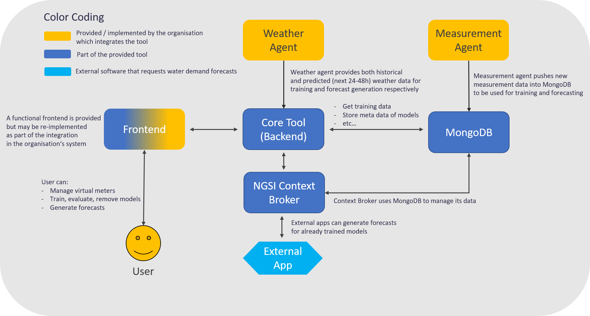
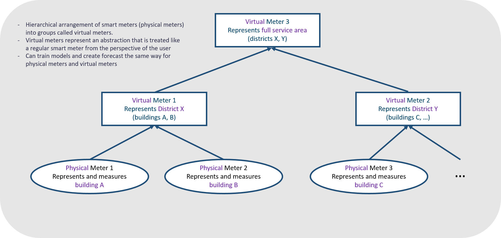

# B-WaterSmart - Short-Term Demand Forecasting Tool

This repository contains the (backend of) the short-term water demand forecasting tool (#28) that was developed as part of the [B-WaterSmart](https://b-watersmart.eu/) project. The tool allows users to train smart meter based machine learning models to create short-term (24h) water demand forecasts at different spatial resolutions. A basic frontend, which can be found in the repository `[not yet available]`, is provided to manage virtual meters (see definition further below), train models, and create forecasts. However, the backend found in this repository is designed to be integrated into existing systems and does not depend on the mentioned frontend.

Please note that the tool is currently in development and thus there are missing parts and known inconsistencies that are being adressed. Nevertheless, this repository gives a good impression on what to expect in the final release at the end of May or beginning of June. If you have any questions, please contact ma.juschak@iww-online.de.

## Tool Architecture

The high level architecture of the tool is shown in the below picture. The most important component is the flask-backend `(core-tool)` that provides a `swagger-documented REST API` to interact with. The API is mainly used by the frontend to manage virtual meters (see section below for more details), train models for virtual or physical meters, and create short-term forecasts. On startup, the core tool also registers with the `NGSI context broker through which external apps can generate forecasts` for already defined virtual meters that have already trained models. External apps cannot define their own virtual meters or train / update models for them.

The core-tool is connected to the `mongodb` database that contains the meta data for the existing physical meters and also the respective consumption data that is used to train models for them. When a virtual meter is defined or a model is trained, the core-tool inserts the associated meta data into the database. The model binaries however are stored on disk. It is the responsibility of the `integrator` (responsible person from the organization that integrates the tool into their system) to provide the data for the physical meters through the `measurement agent`. The measurement agent continuously inserts the historical consumption data of the physical meters into the database that can then be used by the core-tool for training and forecasting. There is no code for the measurement agent in this repository, as it highly depends on the organization. It has to be implemented by the integrator according to the data format that is expected in the database. Please refer to the database section of this document to find out more about how the data is stored in MongoDB.

The tool can make use of additional model features, sometimes referred to as `covariates` to improve forecasting performance. The tool currently only supports weather features (e.g. temperature or precipitation) that need to be provided by the integrator through the `weather agent`. The weather agent is a python module that has to be implemented by the integrator. It has to return a pandas dataframe with hourly data where every column represents a (arbitrarily named) weather feature. Note: even though the weather agent is intended for weather data, it is possible to use it to pass any kind of time series data to the tool if that is necessary.



## Key Concept - Virtual Meters

The tool allows for water demand forecasts that can have as high a spatial resolution as the consumption data is provided as (e.g. forecast per building if consumption data is available per building). At the same time, the tool allows for forecasts of lower spatial resolution than the data is provided as (e.g. forecast per district if consumption data is available per building). To achieve this, an abstraction called virtual meter and its counterpart physical meter is introduced. A `physical meter` represents a physical device that is installed at some place to generate time series data, i.e. a regular smart meter. A `virtual meter` does not exist in the physical world, it represents a group of physical meters (and other virtual meters) and provides a layer of abstraction, because the same kind of operations (train model, create forecast) can be performed on both types of meters. The user can group meters to represent areas at different resolutions and manage them easily. An exemplary hierarchical definition of virtual meters can be found in the picture below.

There are two theoretical approaches to create a forecast for a virtual meter (out of which only the latter is implemented). The first approach is to train a model for each physical meter that is part of the virtual meter and then aggregate the forecasts of the individual models. The second approach is to first aggregate the consumption and weather data and then train a single model for the virtual meter. For scalability reasons, we decided to implement the second approach, as otherwise a huge amount of resources would be required to train and store the models of all physical meters. It seems more reasonable to use the available computing power to optimize a single model as much as possible. As a consequence of this approach, it is `necessary to define how weather data is aggregated` before it is fed into the model. This is the `responsibility of the integrator`, however, there are two recommendations. The first possiblity is to not aggregate the weather features (temperature, precipitation, etc...) at all and instead provide the original time series of every physical meter that is part of the virtual meter. This way, there is no loss of information, but the model input becomes very large and requires a training algorithm that is powerful enough to make use of it (e.g. a deep learning based model). The second possibility is to aggregate every physical meter's weather feature time series into a single time series that represents the "weather of the virtual meter". This leads to a substantial loss of information, as it could for example rain at one building, but not at another building although they are both part of the same virtual meter and represented by the same precipitation time series. Nevertheless, this approach is easier to handle by all algorithms and better to visualize to the user that has to plausiblity check the forecast and make decisions based on it within a limited amount of time. Since the weather data is provided by the integrator (see section "Tool Architecture") and the tool does not make any assumptions about how many and which features are given, it is up to the integrator to choose one of the approaches.



## Forecasting Algorithms

There are currently six implemented forecasting algorithms, covering three general types of models, namely statistical, typical machine learning, and deep learning. Each approach may have different strengths and weaknesses that make them more successful on different data sets which allows the user to compare and choose the algorithm that best fits the use case. All of the algorithms are provided by the [Darts](https://unit8co.github.io/darts/) library which this tool builds on top of to provide a unified and simple interface. The six algorithms (in the ascending order of complexity and potential performance) are:

- `Arima` (statistical)
- `Triple Exponential Smoothing` (statistical)
- `Prophet` (statistical)
- `XGBoost` (typical machine learning / tree based)
- `N-BEATS` (deep learning)
- `Temporal Fusion Transformer` (deep learning / LSTM / Transformer)

Note that not all algorithms can make use of all available data in the same way. For example, Triple Exponential Smoothing can only make use of the consumption data, while the remaining ones can also make use of weather data. More differences between these models can be found in the [Darts documentation](https://unit8co.github.io/darts/userguide/covariates.html).

If the integrator wants to implement an additional algorithm, the following steps are currently necessary:

- Implement the app.models.algorithms.base.ForecasterBase interface
- Integrate the algorithm in the app.models.algorithms.\_\_init\_\_.py file

## Hyperparameter Optimization

For every algorithm, there are two types of hyperparameters. The first kind of parameters are static, they are hardcoded. The second kind of hyperparameters can either be specified by the user or automatically optimized according to a search space defined along with the algorithms. All of these definitions (values of static parameters, default values and search space of tunable parameters) can be changed in the files that contain the algorithm implementations. For hyperparameter optimization, the tool builds on top of the [Ray library](https://docs.ray.io/en/latest/tune/index.html) and uses the `Bayesian Optimization and Hyperband (BOHB)` method for efficiently exploring the search space and finding a close-to-optimal set of hyperparameters.

## Database

The NGSI context broker requires a MongoDB database to function correctly. The core-tool accesses the exact same database to store its own data and to retrieve consumption data for the smart meters. Properties like the db name, db password, collection names, etc... can be modified in the `.env` file of the project. The following collections are created or expected by the core-tool:

- `devices`: Stores meta data on physical meters which we also may call 'devices', as they are based on the [device](https://github.com/smart-data-models/dataModel.Device) smart data model. This collection is **not managed by the tool but by the integrator**, the tool only reads from it.
- `virtualDevices`: Stores meta data on virtual meters. The collection is called `virtualDevices` to reflect its relation to the `devices` collection. This collection is **managed by the tool only**.
- `deviceMeasurements`: Stores the consumption data of the physical meters defined in the collection 'devices'. The format of the datapoints is based on the [DeviceMeasurement](https://github.com/smart-data-models/dataModel.Device/blob/master/DeviceMeasurement/README.md) smart data model. This collection is **not managed by the tool but by the integrator**, the tool only reads from it.
- `mlModel`: Stores the meta data of the trained models. Datapoints are based on the [MlModel](https://github.com/smart-data-models/dataModel.MachineLearning/tree/master/MLModel) smart data model. This collection is **managed by the tool only**.

On first startup, the MongoDB database is initialized via the `db-init/mongo-init.sh` script which populates the devices and deviceMeasurements collections with data from the `db-init/data` folder. The default data found in this folder serves as example for the data format that is expected by the tool.

After a model has been trained, the model meta data is stored in MongoDB, however the binary is stored on disk in the `app/data/models` folder. The tool does not automatically backup any data, it is the responsibility of the integrator to do so.

`Work-in-progress note`: the files in db-init/data are not available yet.

## Starting Steps

1. Install Docker
2. Clone the repository
3. Modify the .env file to your needs
4. Place your organization's data in db-init/data and modify the mongo-init.sh script accordingly
5. Production only: Set up a measurement agent that continuously updates the deviceMeasurements collection in MongoDB.
6. Production only: Set up a weather agent that provides historical and future weather data on demand.
7. Run one of the two below commands:

```console
// For development
docker compose -f docker-compose.yml -f docker-compose.dev.yml up --build

// For production
docker compose -f docker-compose.yml -f up --build
```

`Work-in-progress note`: A production docker-compose file may be provided in the future based on needs.

6. Use the core-tool according to its OpenAPI / Swagger specification that can be found in documentation/swagger.yaml. The specification can for example be viewed with the [Swagger Editor](https://editor.swagger.io/).
